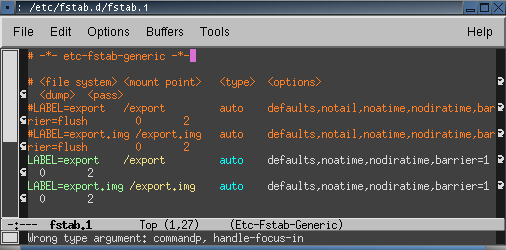

= Emacs Etc Fstab Mode

:blogpost-categories: linux,eamcs

Today I decided to take advantage of the new +/etc/fstab.d/+ directory, so I re-factored my big +/etc/fstab+ file into three separated files under +/etc/fstab.d/+:

. The must-have entries
. The needed entries that will be mounted when system boot up, and 
. The optional entries that will NOT be mounted when system first boot up

However, when I try to edit those split-out files under +/etc/fstab.d/+, I noticed that the nice Emacs font-locking (keyword colouring) is gone. That's uncomfortable, and it took me a while to figure out how to get it back.
 
pass::[<!--more-->]

I know it is all about the mode setting in the first line. E.g., the Eamcs Generic Mode Wiki, http://www.emacswiki.org/emacs/GenericMode, suggests to add the following to the first line to the files of obscure programs:

    # -*- mode: default-generic -*-

However, that doesn't come out as nicely as my exiting font-locking, which is called +Etc-Fstab-Generic+ from the mode line. 

It took me a while to figure out that the correct mode setting in the first line is:

  # -*- etc-fstab-generic -*-

Now my files under +/etc/fstab.d/+ looks normal again:

Yeaa~~. 

*EDIT:* 

I have to move them back to +/etc/fstab+ file because +mount+ cannot read +/etc/fstab.d+, only the library (+libmount+) can:

 % mount /mnt/tmp1 
 mount: can't find /mnt/tmp1 in /etc/fstab or /etc/mtab

From http://askubuntu.com/questions/168290/why-cant-mount-read-files-in-etc-fstab-d,

[quote, Karel Zak; answered Jul 30 '12]
____________________________
The /etc/fstab.d support has been reverted from mount(8) after upstream discussion. The mount tab directories are supported by libmount only. It's not planned to support fstab.d in mount(8) by default.

The problem is that /etc/fstab is de facto standard used on many places (libc, systemd, UI programs, ..) and it's unreal wish that all the places can be changed to support fstab.d.

Anyway, you can use a new mount(8) from util-linux >= 2.21 and a new option --fstab to specify alternative mount table, this option also supports directories. It means you have to explicitly specify the directory -- mount(8) will not read it by default. See mount(8) man page for more details.
____________________________
