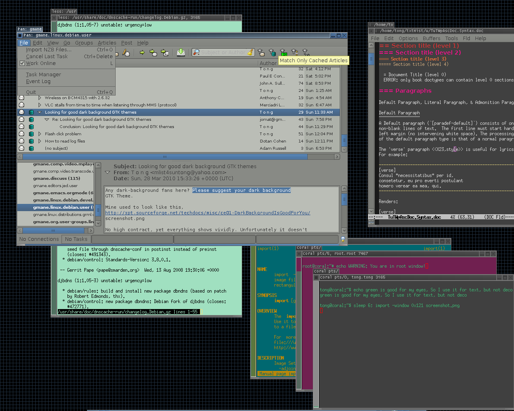

Good dark-background GTK2 theme

:blogpost-categories: GTK2,Desktop theme,Xapps,interface

This is a conclusion summary for discussion

http://thread.gmane.org/gmane.linux.debian.user/377753

In brief, I was looking for good dark background GTK Themes. 

Mine used to look like this, unfortunately it doesn't work for the updated GTK any more, thus the whole discussion. 

image:http://xpt.sourceforge.net/techdocs/misc/ce01-DarkBackgroundIsGoodForYou/screenshot.png["Old dark background GTK theme",link="http://xpt.sourceforge.net/techdocs/misc/ce01-DarkBackgroundIsGoodForYou/screenshot.png"]

Basically, I am looking for a GTK2 theme that

. is generally dark, light on dark.
. shouldn't have high contract -- white on black hurts my eyes more than it helps.
. can still allow me to tell things apart -- some themes that I tried, everything is almost in complete darkness, I can barely tell where the boundaries are, and even the texts.
. easy to install -- some themes looks great, but depends on some supper cool theme engines as well. I don't know where to find them and how to install them. 
. better off, it should be simple, doesn't need to be fancy, and doesn't take much of my disk space. The more simple it is, the more chance that I am able to tweak it myself.

pass::[<!--more-->]

The hunting has finished. My current GTK theme 

- doesn't have any image files but only a single 'gtkrc' file, so the whole thing zip up to merely less than 3k in size. 
- It is base on the Clearlooks theme that comes default in any distro, so I don't need to install any extra theme engines.
- It is very easy to change the entire look/tone, because it is super easy to tweak.

All this is made possible thanks to the "Clearlooks Compact" theme by Martin Ankerl martin.ankerl <at> gmail.com, which my theme is based on.

http://art.gnome.org/download/themes/gtk2/1377/GTK2-ClearlooksCompact.tar.bz2

The only thing I replaced is the Martin's gtk_color_scheme setting, with the following:

 gtk_color_scheme = 
 "fg_color:#3e3e3e
 bg_color:#888a85
 base_color:#babdb6
 text_color:gray21
 selected_bg_color:#4f76a0
 selected_fg_color:#fff
 tooltip_bg_color:#F5F5B5
 tooltip_fg_color:gray30"

The result is a generally dark theme, with no high contract, just mild tones, yet everything shows vividly clear. The reason that the GTK text entry area looks lighter than my previous theme is because, the colour is also used by my Mozilla. I.e., with so many web pages still using the black-on-white themes, such setting will not create much big contract between those web pages and my overall theme. Here is my scree shot:

If anyone want to use it, just tweak the 'gtk_color_scheme', especially the 'selected_bg_color' to your taste. 
